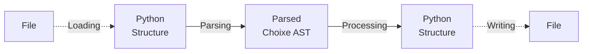

# Choixe - Configurations With Superpowers!

## Introduction

**Choixe** is a package that adds some cool features to markup configuration files,
such as: 

- **Variables**: placeholders for something that will be defined later.
- **Imports**: append the content of another configuration file anywhere.
- **Sweeps**: exhaustive search over a parameter space.
- **Python Instances**: invocation of dynamically imported python callables.
- **Loops**: foreach-like control that iterates over a collection of elements.

Currently supported formats include: 
- YAML
- JSON

Note that any markup format that can be deserialized into python built-ins can work
with **Choixe** syntax. In fact, you can use these features even with no configuration
file at all, by just putting some **directives** into a plain python dictionary or list,
**Choixe** does not care.

All that **Choixe** does is the following:



1. Optionally **load** a **structure** from a markup file. The structure usually consists of
   nested python **dictionaries** or **lists**, containing built-in types like integers,
   floats, booleans, strings. 
2. **Parse** the structure into an **AST**, looking for a special syntactic pattern - 
   called **"directive"** - in every string that is found. 
3. **Process** the **AST** by visiting it recursively, resulting in a another python
   structure.
4. Optionally **write** the new structure to a markup file.

For simplicity, in the rest of this tutorial most examples will be written in YAML,
as it is less verbose than JSON or python syntax.

## Syntax

As I may have anticipated, **Choixe** features are enabled when a **directive** is found.
A **directive** must always start with a `$` and can have two forms: "compact" or "call".

### Compact Form

```
$DIRECTIVE_NAME
``` 

Basically a `$` followed by a name. The name must follow the rules of python identifiers,
so only alphanumeric characters and underscores ( `_` ), the name cannot start with a
digit.

Examples:
-  `$model`
-  `$call`

### Call Form

```
$DIRECTIVE_NAME(ARGS, KWARGS)
```

The call form extends the compact form with a pair of parenthesis containing the 
directive arguments. Arguments follow the rules of a plain python function call, in fact,
they are parsed using the python interpreter.

Examples:
- `$var(x, default="hello", env=False)`
- `$for(object.list, x)`

The compact form is essentially a shortcut for the call form when no arguments are
needed: `$model` is equivalent to `$model()`.

**Note**: due to some limitations of the current lexer, directives can contain **at most** one
set of parenthesis, meaning that you are **not** allowed to nest them like this:

- ~~`$directive(arg1=(1, 2, 3))`~~
- ~~`$directive(arg1="meow", arg2=$directive2(10, 20))`~~

### String Bundles

Directives can also be mixed with plain strings, creating a "String Bundle":

`$var(animal.name) is a $var(animal.species) and their owner is $var(animal.owner, default="unknown")`

In this case, the string is tokenized into 5 parts:
1. `$var(animal.name)`
2. ` is a `
3. `$var(animal.species)`
4. ` and their owner is `
5. `$var(animal.owner, default="unknown")`

The result of the computation is the string concatenation of the result of each
individual token: `Oliver is a cat and their owner is Alice`.

## Variables

## Imports

## Sweeps

## Instances

## Loops

## XConfig

### Interaction

### I/O

### Processing

### Flattening

### Inspection