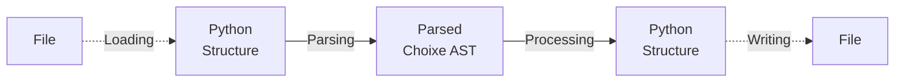

# Choixe - Configurations With Superpowers!

## Introduction

**Choixe** is a package that adds some cool features to markup configuration files,
such as: 

- **Variables**: placeholders for something that will be defined later.
- **Imports**: append the content of another configuration file anywhere.
- **Sweeps**: exhaustive search over a parameter space.
- **Python Instances**: calling of dynamically imported python functions.
- **Loops**: foreach-like control that iterates over a collection of elements.

Currently supported formats include: 
- YAML
- JSON

Note that any markup format that can be deserialized into python built-ins can work with **Choixe** syntax. In fact, you can use these features even with no configuration file at all, by just putting some **directives** into a plain python dictionary or list, **Choixe** does not care.

All that **Choixe** does is the following:



1. Optionally **load** a **structure** from a markup file. The structure usually consists of
   nested python **dictionaries** or **lists**, containing built-in types like integers,
   floats, booleans, strings. 
2. **Parse** the structure into an **AST**, looking for a special syntactic pattern - 
   called **"directive"** - in every string that is found. 
3. **Process** the **AST** by visiting it recursively, resulting in a another python
   structure.
4. Optionally **write** the new structure to a markup file.

For simplicity, in the rest of this tutorial most examples will be written in YAML, as it is less verbose than JSON or python syntax.

## Syntax

As I may have anticipated, **Choixe** features are enabled when a **directive** is found. A **directive** must always start with a `$` and can have two forms: "compact" or "call".

### Compact Form

```
$DIRECTIVE_NAME
``` 

Basically a `$` followed by a name. The name must follow the rules of python identifiers, so only alphanumeric characters and underscores ( `_` ), the name cannot start with a digit.

Examples:
-  `$model`
-  `$call`

### Call Form

```
$DIRECTIVE_NAME(ARGS, KWARGS)
```

The call form extends the compact form with a pair of parenthesis containing the directive arguments. Arguments follow the rules of a plain python function call, in fact, they are parsed using the python interpreter.

Examples:
- `$var(x, default="hello", env=False)`
- `$for(object.list, x)`

The compact form is essentially a shortcut for the call form when no arguments are needed: `$model` is equivalent to `$model()`.

**Note**: due to some limitations of the current lexer, directives can contain **at most** one set of parenthesis, meaning that you are **not** allowed to nest them like this:

- ~~`$directive(arg1=(1, 2, 3))`~~
- ~~`$directive(arg1="meow", arg2=$directive2(10, 20))`~~

### String Bundles

Directives can also be mixed with plain strings, creating a "String Bundle":

`$var(animal.name) is a $var(animal.species) and their owner is $var(animal.owner, default="unknown")`

In this case, the string is tokenized into 5 parts:
1. `$var(animal.name)`
2. ` is a `
3. `$var(animal.species)`
4. ` and their owner is `
5. `$var(animal.owner, default="unknown")`

The result of the computation is the string concatenation of the result of each individual token: `Oliver is a cat and their owner is Alice`.

### Arguments

Directive **arguments** can be of two types:
- **Literal**, raw data including explicitly defined numbers (`10`, `0.23`), boolean values (`True` or `False`) strings enclosed by either single quotes `' '` or double quotes `" "`.
- **Id**, strings not surrounded by quotes. They have generally different semantics and usually represent abstract concepts like variable names. Ids can contain dots like `parent.child`.

## Variables

Suppose you have a very long and complex configuration file, and you often need to change some values in it, depending on external factors. You can:

- Manually edit it each time, waste some time looking for the specific value to edit, keep a history of the changes or otherwise you won't be able to go back.
- Keep the files immutable but instead create a duplicate for every possible value, and when you eventually realize something was wrong with the original file, you have to propagate the changes in all the 20.000 copies you created.
- Replace the values you need to change with **Variables**, and let **Choixe** fill in the values for you, keeping only **one**, **immutable** version of the original file.

The following example consists in a toy configuration file for a deep learning training task, involving a moderate amount of parameters. Your configuration file looks like this:

```yaml
model:
  architecture:
    backbone: resnet18
    use_batch_norm: false
    heads:
      - type: classification
        num_classes: 10
      - type: classification
        num_classes: 7
training:
  device: cuda
  epochs: 100
  optimizer: 
    type: Adam
    params:
      learning_rate: 0.001
      betas: [0.9, 0.99]
```

In this toy configuration file there are some parameters entirely dependant from the 
task at hand. Take for instance the number of classes, whenever you decide to perform
a training on a different dataset, the number of classes is inevitably going to change.

To avoid the pitfalls described earlier, you can use **variables**. Think of a **variable** 
as a placeholder for something that will be defined later. **Variables** values are picked at runtime from a structure referred to as **"context"**, that can be passed to **Choixe** python
API.

To use variables, simply replace a literal value with a `var` directive: 

`$var(identifier: Id, default: Literal = None, env: Literal[bool] = False)`

Where:
- `identifier` is the **pydash** path (dot notation only) where the value is looked up in the **context**.
- `default` is a literal value to use when the context lookup fails - essentially making the variable entirely optional. Defaults to `None`.
- `env` is a literal bool that, if set to `True`, will also look at the system environment variables in case the **context** lookup fails. Defaults to `False`.

Here is what the deep learning toy configuration looks like after replacing some values with **variables**: 

```yaml
model:
  architecture:
    backbone: resnet18
    use_batch_norm: $var(hparams.normalize, default=True)
    heads:
      - type: classification
        num_classes: $var(data.num_classes1) # No default: entirely task dependant
      - type: classification
        num_classes: $var(data.num_classes2) # No default: entirely task dependant
training:
  device: $var(TRAINING_DEVICE, default="cpu", env=True) # Choose device based on env vars.
  epochs: $var(hparams.num_epochs, default=100)
  optimizer: 
    type: Adam
    params:
      learning_rate: $var(hparams.lr, default=0.001)
      betas: [0.9, 0.99]
```

The minimal **context** needed to use this configuration will look something like this:

```yaml
data:
  num_classes1: 10
  num_classes2: 7
```

The full context can contain all of these options:

```yaml
data:
  num_classes1: 10
  num_classes2: 7
hparams:
  normalize: true # Optional
  num_epochs: 100 # Optional
  lr: 0.001 # Optional
TRAINING_DEVICE: cuda # Optional, env
```

**Contexts** can also be seen as a "meta-configuration" providing an easier and cleaner access to a subset of "public" parameters of a templatized "private" configuration file with lots of details to keep hidden.

## Imports

## Sweeps

## Instances

## Loops

## XConfig

### Interaction

### I/O

### Processing

### Flattening

### Inspection