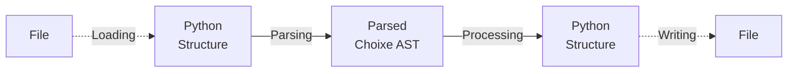

# Choixe - Configurations With Superpowers!

## Introduction

**Choixe** is a mini-language built on top of python that adds some cool features to markup configuration files, with the intent of increasing code reusability and automatizing some aspects of writing configuration files.

- **Variables**: placeholders for something that will be defined later.
- **Imports**: append the content of another configuration file anywhere.
- **Sweeps**: exhaustive search over a parameter space.
- **Python Instances**: calling of dynamically imported python functions.
- **Loops**: foreach-like control that iterates over a collection of elements.

Currently supported formats include: 
- YAML
- JSON

Note that any markup format that can be deserialized into python built-ins can work with **Choixe** syntax. In fact, you can use these features even with no configuration file at all, by just putting some **directives** into a plain python dictionary or list, **Choixe** does not care.

All that **Choixe** does is the following:



1. Optionally **load** a **structure** from a markup file. The structure usually consists of
   nested python **dictionaries** or **lists**, containing built-in types like integers,
   floats, booleans, strings. 
2. **Parse** the structure into an **AST**, looking for a special syntactic pattern - 
   called **"directive"** - in every string that is found. 
3. **Process** the **AST** by visiting it recursively, resulting in a another python
   structure.
4. Optionally **write** the new structure to a markup file.

For simplicity, in the rest of this tutorial most examples will be written in YAML, as it is less verbose than JSON or python syntax.

## Syntax

As I may have anticipated, **Choixe** features are enabled when a **directive** is found. **Directives** are special strings or special dictionaries that can appear in different forms:
- "compact"
- "call"
- "extended"
- "special"

**Note**: some directives are available only in a subset of the previous forms.

### Compact Form

```yaml
$DIRECTIVE_NAME
``` 

Basically a `$` followed by a name. The name must follow the rules of python identifiers, so only alphanumeric characters and underscores ( `_` ), the name cannot start with a digit.

Examples:
-  `$index`
-  `$item`

Only directives without parameters can be expressed in the compact form.

### Call Form

```yaml
$DIRECTIVE_NAME(ARGS, KWARGS)
```

The call form extends the compact form with a pair of parenthesis containing the directive arguments. Arguments follow the rules of a plain python function call, in fact, they are parsed using the python interpreter.

Examples:
- `$var(x, default=hello, env=False)`
- `$for(object.list, x)`

The compact form is essentially a shortcut for the call form when no arguments are needed: `$model` is equivalent to `$model()`.

**Note**: due to some limitations of the current lexer, call forms can contain **at most** one set of parenthesis, meaning that you are **not** allowed to nest them like this:

- ~~`$directive(arg1=(1, 2, 3))`~~
- ~~`$directive(arg1="meow", arg2=$directive2(10, 20))`~~

If you really need to nest **directives**, you must use the **extended form**, introduced in the next paragraph.

### Extended Form

```yaml
$directive: DIRECTIVE_NAME
$args: LIST_OF_ARGS
$kwargs: DICT_OF_KWARGS
```

The extended form is a more verbose and more explicit alternative that allows to pass complex arguments that cannot be expressed with the current limitations of the call form. 

Examples:
- ```yaml
  $directive: var
  $args:
    - x
  $kwargs:
    default: hello
    env: false
  ```
- ```yaml
  $directive: sweep
  $args:
    - 10
    - [10, 20]
    - a: $var(x, default=30) # Directive nesting
      b: 60
  $kwargs: {}
  ```

### Special Form

Some **directives** are available only with special forms, i.e. some forms that do not have a schema, and depend from the specific **directive** used. Do not worry, they are just a few, they are detailed below and their schema is easy to remember.

### String Bundles

**Directives** can also be mixed with plain strings, creating a "String Bundle":

`$var(animal.name) is a $var(animal.species) and their owner is $var(animal.owner, default="unknown")`

In this case, the string is tokenized into 5 parts:
1. `$var(animal.name)`
2. ` is a `
3. `$var(animal.species)`
4. ` and their owner is `
5. `$var(animal.owner, default="unknown")`

The result of the computation is the string concatenation of the result of each individual token: `Oliver is a cat and their owner is Alice`.

### Directive table

| Directive | Compact | Call  | Extended | Special |
| :-------: | :-----: | :---: | :------: | :-----: |
|   `var`   |    ❌    |   ✔️   |    ✔️     |    ❌    |
| `import`  |    ❌    |   ✔️   |    ✔️     |    ❌    |
|  `sweep`  |    ❌    |   ✔️   |    ✔️     |    ❌    |
|  `call`   |    ❌    |   ❌   |    ❌     |    ✔️    |
|  `model`  |    ❌    |   ❌   |    ❌     |    ✔️    |
|   `for`   |    ❌    |   ❌   |    ❌     |    ✔️    |
|  `item`   |    ✔️    |   ✔️   |    ✔️     |    ❌    |
|  `index`  |    ✔️    |   ✔️   |    ✔️     |    ❌    |

## Variables

Suppose you have a very long and complex configuration file, and you often need to change some values in it, depending on external factors. You can:

- Manually edit it each time, waste some time looking for the specific value to edit, keep a history of the changes or otherwise you won't be able to go back.
- Keep the files immutable but instead create a duplicate for every possible value, and when you eventually realize something was wrong with the original file, you have to propagate the changes in all the 20.000 copies you created.
- Replace the values you need to change with **Variables**, and let **Choixe** fill in the values for you, keeping only **one**, **immutable** version of the original file.

The following example consists in a toy configuration file for a deep learning training task, involving a moderate amount of parameters. Your configuration file looks like this:

```yaml
model:
  architecture:
    backbone: resnet18
    use_batch_norm: false
    heads:
      - type: classification
        num_classes: 10
      - type: classification
        num_classes: 7
training:
  device: cuda
  epochs: 100
  optimizer: 
    type: Adam
    params:
      learning_rate: 0.001
      betas: [0.9, 0.99]
```

In this toy configuration file there are some parameters entirely dependant from the 
task at hand. Take for instance the number of classes, whenever you decide to perform
a training on a different dataset, the number of classes is inevitably going to change.

To avoid the pitfalls described earlier, you can use **variables**. Think of a **variable** 
as a placeholder for something that will be defined later. **Variables** values are picked at runtime from a structure referred to as **"context"**, that can be passed to **Choixe** python
API.

To use variables, simply replace a literal value with a `var` directive: 

`$var(identifier: str, default: Optional[Any] = None, env: bool = False)`

Where:
- `identifier` is the **pydash** path (dot notation only) where the value is looked up in the **context**.
- `default` is a value to use when the context lookup fails - essentially making the variable entirely optional. Defaults to `None`.
- `env` is a bool that, if set to `True`, will also look at the system environment variables in case the **context** lookup fails. Defaults to `False`.

Here is what the deep learning toy configuration looks like after replacing some values with **variables**: 

```yaml
model:
  architecture:
    backbone: resnet18
    use_batch_norm: $var(hparams.normalize, default=True)
    heads:
      - type: classification
        num_classes: $var(data.num_classes1) # No default: entirely task dependant
      - type: classification
        num_classes: $var(data.num_classes2) # No default: entirely task dependant
training:
  device: $var(TRAINING_DEVICE, default=cpu, env=True) # Choose device based on env vars.
  epochs: $var(hparams.num_epochs, default=100)
  optimizer: 
    type: Adam
    params:
      learning_rate: $var(hparams.lr, default=0.001)
      betas: [0.9, 0.99]
```

The minimal **context** needed to use this configuration will look something like this:

```yaml
data:
  num_classes1: 10
  num_classes2: 7
```

The full context can contain all of these options:

```yaml
data:
  num_classes1: 10
  num_classes2: 7
hparams:
  normalize: true # Optional
  num_epochs: 100 # Optional
  lr: 0.001 # Optional
TRAINING_DEVICE: cuda # Optional, env
```

**Contexts** can also be seen as a "meta-configuration" providing an easier and cleaner access to a subset of "public" parameters of a templatized "private" configuration file with lots of details to keep hidden.

## Imports

Imagine having a configuration file in which some parts could be reused in other configuration files. It's not the best idea to duplicate them, instead, you can move those parts in a separate configuration file and dynamically import it using the `import` **directive**.

To use an import directive, replace any node of the configuration with the following directive:

`$import(path: str)`

Where:
  - `path` can be an absolute or relative path to another configuration file. If the path is relative, it will be resolved relatively from the parent folder of the importing configuration file, or, in case there is no importing file, the system current working directive.

Let's build on top of the previous "deep learning" example:

```yaml
model:
  architecture:
    backbone: resnet18
    use_batch_norm: $var(hparams.normalize, default=True)
    heads:
      - type: classification
        num_classes: $var(data.num_classes1)
      - type: classification
        num_classes: $var(data.num_classes2)
training:
  device: $var(TRAINING_DEVICE, default=cpu, env=True)
  epochs: $var(hparams.num_epochs, default=100)
  optimizer: 
    type: Adam
    params:
      learning_rate: $var(hparams.lr, default=0.001)
      betas: [0.9, 0.99]
```

Here, one could choose to factor out the `optimizer` node and move it into a separate file called "adam.yml".

```yaml
# neural_network.yml
model:
  architecture:
    backbone: resnet18
    use_batch_norm: $var(hparams.normalize, default=True)
    heads:
      - type: classification
        num_classes: $var(data.num_classes1)
      - type: classification
        num_classes: $var(data.num_classes2)
training:
  device: $var(TRAINING_DEVICE, default=cpu, env=True)
  epochs: $var(hparams.num_epochs, default=100)
  optimizer: $import(adam.yml)
```

```yaml
# adam.yml
type: Adam
params:
  learning_rate: $var(hparams.lr, default=0.001)
  betas: [0.9, 0.99]
```

Note that "adam.yml" contains some **directives**. This is not a problem and it is handled automatically by **Choixe**. There is also no restriction on using **imports** in imported files, you can nest them as you please.

## Sweeps

## Instances

## Loops

## XConfig

### Interaction

### I/O

### Processing

### Flattening

### Inspection